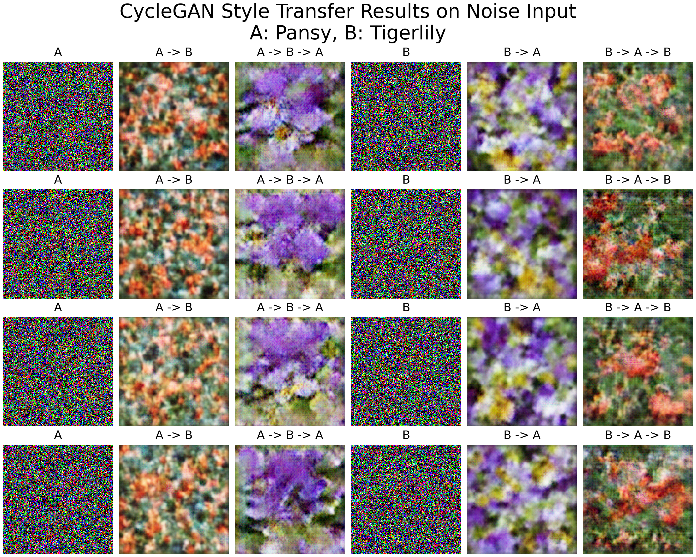

# `Style Transfer` using CycleGAN on 17flowers dataset

## Dataset

* dataset: 17flowers
* Image A: Pansy flower (image_1281 to image_1360)
* Image B: Tigerlily flower (image_0481 to image_0560)

## Results

### Visualising base styles (using noise as input)

### Flower A to Flower B

### Pansy to Tigerlily style transfer recursively

